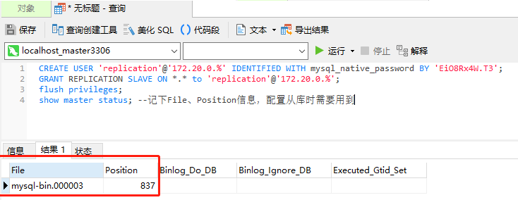

biz-parent
============


### 项目介绍
SpringCloud微服务开发脚手架

### 模块说明
> 注: 详细介绍请参考各模块的 **README.md** 文档
1.  biz-archetype  
     项目骨架生成模块。支持自定义项目模版骨架
     [更多](https://github.com/W-Beatles/biz-archetype/blob/main/README.md)  
2.  biz-boot-starter-dynamic-datasource  
     动态数据源模块。支持读写分离、多数据源动态切换、健康检查。兼容`seata`分布式事务解决方案
     [更多](https://github.com/W-Beatles/biz-boot-starter-dynamic-datasource/blob/main/README.md)  
3.  biz-boot-starter-logger  
     日志模块。用于日志上传`ELK`、`Sentry`错误告警、`SkyWalking`
     [更多](https://github.com/W-Beatles/biz-boot-starter-logger/blob/main/README.md)
4.  biz-boot-starter-sequence  
     基于`zookeeper`和`snowflake`算法的分布式id生成器
     [更多](https://github.com/W-Beatles/biz-boot-starter-sequence/blob/main/README.md)
5.  biz-facade-common  
     通用`facade`模块。包括异常、枚举等基类，以及请求、返回对象基类等
     [更多](./biz-facade-common/README.md)
6.  biz-spring-boot-admin  
     SpringBoot Admin监控模块
     [更多](./biz-spring-boot-admin/README.md)
7.  biz-spring-cloud-api-service-order  
     微服务测试模块 - 订单模块
     [更多](./biz-spring-cloud-api-service-order/README.md)
8.  biz-spring-cloud-api-service-product  
     微服务测试模块 - 产品模块
     [更多](./biz-spring-cloud-api-service-product/README.md)
9. biz-spring-cloud-api-service-utility  
     公共服务。提供excel异步导出服务、短链生成及重定向、省市区查询、ip地址反查、手机号归属查询等基础服务
     [更多](./biz-spring-cloud-api-service-utility/README.md)
10. biz-spring-cloud-api-starter  
     spring-cloud starter模块。封装MDC过滤器、接口/方法切面、分布式锁等开箱即用的功能
     [更多](./biz-spring-cloud-api-starter/README.md)
11. biz-spring-cloud-common  
      spring-cloud项目通用类库
     [更多](./biz-spring-cloud-common/README.md)
12. ~~biz-spring-cloud-dashboard-hystrix(已废弃)~~  
      推荐使用biz-spring-cloud-dashboard-turbine来进行hystrix断路器监控
13. biz-spring-cloud-dashboard-turbine  
      用于监控应用hystrix.stream端点，并进行hystrix断路器信息聚合
     [更多](./biz-spring-cloud-dashboard-turbine/README.md)
14. biz-spring-cloud-eureka  
      Eureka注册中心
     [更多](./biz-spring-cloud-eureka/README.md)
15. biz-spring-cloud-gateway  
      API网关。用于微服务代理及网关鉴权，并提供swagger文档聚合功能
     [更多](./biz-spring-cloud-gateway/README.md)
16. biz-spring-cloud-oauth-server  
      oauth2统一认证授权中心
     [更多](./biz-spring-cloud-oauth-server/README.md)
17. biz-spring-cloud-test  
      测试模块
     [更多](./biz-spring-cloud-test/README.md)

### TODO LIST
> 注: ~~ ~~划线部分为已完成功能~~ ~~

1. ~~支持微服务调用全链路日志追踪。添加`request-id`(请求唯一标识，网关生成或来自外部请求头，格式为UUID)、`app-id`(应用唯一标识)、`app-name`(应用名称)、
   `trace-app-names`(appName调用链路记录，以`,`分割)、`trace-host-names`(hostName调用链路记录，以`,`分割)、
   `trace-host-addresses`(hostAddress调用链路记录，以`,`分割)~~
   - ~~支持Feign调用传递请求头信息~~
   - ~~支持RestTemplate调用传递请求头信息~~
2. ~~日志模块支持kafka日志上传~~  
3. 完善动态数据源模块  
   - ~~支持注解声明式指定数据源~~
   - 集成`seata`分布式事务解决方案
5. 添加文件上传模块 `biz-spring-cloud-api-file-upload`，并提供基础SDK  
   - 支持私有、公有文件上传，接入`云OSS`及`七牛云服务`存储服务，私有文件采用`FastDFS`分布式文件系统存储  
6. ~~添加统一认证鉴权模块biz-spring-cloud-oauth-server(待完善)~~  
7. SpringCloud Gateway网关支持多种业务渠道认证和授权。支持多平台，如企业微信、网页、小程序。支持多种登录方式，如密码、验证码、扫码  
8. ~~SpringCloud Gateway网关支持限流~~  
9. 添加分布式任务调度系统模块(扩展xxl-job)  
   - 支持任务前置依赖配置
   - 支持任务优先级配置
   - 支持任务手动执行指定服务器IP
   - 定制RPC通信协议，支持跨语言跨平台调度
   - 新加任务执行线程池，替换JobThread,减少线程创建销毁带来的开销 `@see https://github.com/XuMinCha/xxl-job`
   - 新增注解@MultiplexJobHandler和@JobMethod，支持方法级别任务，类似spring的@scheduled `@see https://github.com/XuMinCha/xxl-job`
10. ~~utility模块添加excel异步下载功能~~  
11. 添加Sms短信服务模块，并提供基础SDK  
12. 添加Email发送服务模块，并提供基础SDK  
13. 添加企业微信通知服务模块，并提供基础SDK  
14. utility模块添加ip地址反查、手机号归属查询服务  
15. [perf] gateway使用WebClient优化接口调用，减少NIO请求 
16. sequence支持多渠道生成，单渠道id唯一
17. 支持nacos注册中心(见alibaba分支)

### docker快速启动
为方便快速启动相关服务，提供`docker-compose`容器编排脚本，使用几个简单的命令即可启动相关服务模块

#### docker-compose相关命令
```
docker-compose up -d                   # 初始化容器，如果容器不存在根据镜像自动创建
docker-compose down -v                 # 停止容器并删除容器
docker-compose start                   # 启动容器
docker-compose restart                 # 重启容器
docker-compose stop                    # 停止容器
docker-compose ps                      # 查看服务启动情况
docker-compose logs -f --tail=10       # 查看compose日志
docker-compose -h                      # 查看更多相关命令
```

#### 快速启动相关说明
1. 进入`./docker`目录, 执行`docker-compose up -d`，或者`docker-compose up -d {服务名1} {服务名2} ...`来启动指定服务  
    服务模块清单如下: 
    
    |  服务            |   服务名                 |  端口        |  帐号/密码         |  地址                                     |
    |------------------|-------------------------|--------------|-------------------|------------------------------------------|
    |  * 数据库(主)     |   mysql-master          |  3306        |  root/123456      |                                          |
    |  * 数据库(从)     |   mysql-slave1          |  3307        |  root/123456      |                                          |
    |  * 数据库(从)     |   mysql-slave2          |  3308        |  root/123456      |                                          |
    |  * KV缓存        |   redis                 |  6379         |  123456           |                                         |
    |  * 消息中间件     |   rabbitmq              |  5672        |  waynechu/123456  |  http://localhost:15672                  |
    |  zookeeper       |   zk、zk2、zk3          |  2181-2183    |                   |                                         |
    |  搜索引擎         |  elasticsearch          |  9200        |                   |                                          |
    |  日志分析工具     |  kibana                 |  5601         |                   |  http://localhost:5601                  |
    |  日志收集工具     |  logstash               |  7002         |                   |                                         |
    |  配置中心         |  apollo                 |  9070        |  apollo/admin     |  http://localhost:8070                  |
    |  配置中心db       |  apollo-db              |  3316        |                   |                                         |
    |  * 注册中心       |  eureka                 |  9001-9009   |                   |  http://localhost:9001                  |
    |  网关             |  gateway               |  9010        |                   |  http://localhost:9010/swagger-ui.html  |
    |  监控中心         |  boot-admin             |  9020        |                   |  http://localhost:9020                   |
    |  skywalking-oap  |  skywalking-oap         |  12800       |                   |                                          |
    |  skywalking-ui   |  skywalking-ui          |  8090        |                   |  http://localhost:8090                   |
    |  统一认证服务     |  oauth-server           |  9050-9059   |                   |  http://localhost:9050                   |
    |  代码生成后端服务  |  archetype-portal       |  9060        |                   |  http://localhost:9060                   |
    |  订单服务         |  service-order          |  10010-10019 |                   |  http://localhost:10010/swagger-ui.html  |
    |  订单服务         |  service-product        |  10020-10029 |                   |  http://localhost:10020/swagger-ui.html  |
    |  公共服务         |  service-utility        |  10030-10039 |                   |  http://localhost:10030/swagger-ui.html  |

2. 服务前加`*`代表必须依赖的基础服务，需优先启动  
3. 启动所有服务会消耗大量的内存，除基础服务外，其它服务可根据需要选择性启动
4. 服务之间存在依赖关系，compose脚本配置的`depends_on`属性无法决定依赖的服务是否完全启动，如果依赖的服务尚未启动完毕，后续相关服务会报出大量的错误。  
   推荐按以下顺序初始化容器：  
   ```
   docker-compose up -d mysql-master mysql-slave1 mysql-slave2 redis rabbitmq apollo-db  
   docker-compose up -d apollo elasticsearch  
   docker-compose up -d skywalking-oap logstash kibana  
   docker-compose up -d eureka  
   docker-compose up -d zk  
   docker-compose up -d gateway boot-admin skywalking-ui  
   docker-compose up -d {other services}  
   ```
5. 使用`--scale`参数可对服务进行水平扩容。如: `docker-compose up -d --scale service-order=2 service-order`  

#### 启动步骤说明
1. 打包所有模块并构建`docker`镜像  
    ```
    # 进入项目根目录
    cd ./biz-parent
    # 拉取子模块
    git submodule update --init --recursive
    # 打包所有模块并构建docker镜像
    mvn clean install -Ddockerfile.skip=false
    ```
   注:   
   1. 如果只更改了单个模块的代码，可手动为该模块单独重新构建镜像
       ```
       docker build -t waynechu/biz-archetype-portal:1.0.0-SNAPSHOT . --build-arg JAR_FILE=./target/biz-archetype-portal-api-1.0.0-SNAPSHOT.jar
       ```
   2. 如果`dockerfile-maven-plugin` 抛出 `HttpHostConnectException: Connect to localhost:2375` 异常，需要检查你本地的docker服务是否开启2375端口的服务

2. 启动基础服务。包括主从库、Redis、rabbitmq、apollo数据库等  
    ```
    cd ./docker
    docker-compose up -d mysql-master mysql-slave1 mysql-slave2 redis rabbitmq apollo-db
    ```
    注：可使用 `docker-compose logs -f --tail=10` 查看`compose`日志，然后等待基础服务启动完成

3. ~~配置MySQL主从链路~~  
    **最新版本已经支持脚本自动配置主从复制链路，已无需手动配置，详见`init-master.sh`、`init-slave.sh`**。如出现未自动同步复制链路的情况，可执行以下命令手动配置  
    1. 登录主库并配置主从同步链路用户权限
        ```
        CREATE USER 'replication'@'172.20.0.%' IDENTIFIED WITH mysql_native_password BY 'EiO8Rx4W.T3';
        GRANT REPLICATION SLAVE ON *.* to 'replication'@'172.20.0.%';
        flush privileges; -- 刷新权限
        show master status; -- 记下File、Position信息，配置从库时需要用到
        ```
       
        
    2. 登录从库并启动复制链路(从库都需要执行)
        ```
        change master to master_host='mysql-master',master_user='replication',master_password='EiO8Rx4W.T3',master_log_file='mysql-bin.000003',master_log_pos=837,master_port=3306;
        start slave; -- 开启主从复制链路
        show slave status; -- Slave_IO_Running 和 Slave_SQL_Running 为 YES 代表配置成功
        ```
        
    3. 检测主从链路是否同步成功。修改主库数据，检查从库是否同步即可  

4. 启动apollo、elasticsearch服务。其中apollo为必须依赖，es可选启动
    ```
    docker-compose up -d apollo elasticsearch
    ```
5. 启动logstash、kibana、skywalking-oap服务。这三个都是可选服务
    ```
    docker-compose up -d logstash kibana skywalking-oap
    ```
6. 启动eureka服务
    ```
    docker-compose up -d eureka
    ```
7. 启动网关、boot-admin监控、skywalking控制台。网关为必须依赖服务，其他两个可选
    ```
    docker-compose up -d gateway boot-admin skywalking-ui
    ```
8. 启动统一认证服务
    ```
    docker-compose up -d oauth-server
    ```
9. 启动zk集群(sequence分布式id生成器必须依赖)
    ```
    docker-compose up -d zk
    ```
9. 启动统一其它服务
    ```
    docker-compose up -d service-utility
    docker-compose up -d archetype-portal
    docker-compose up -d service-order
    docker-compose up -d service-product
    ```
