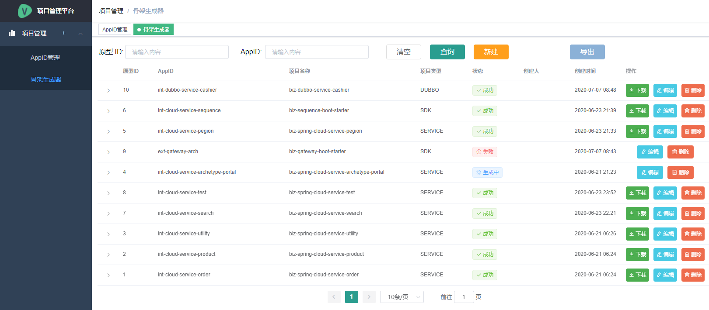
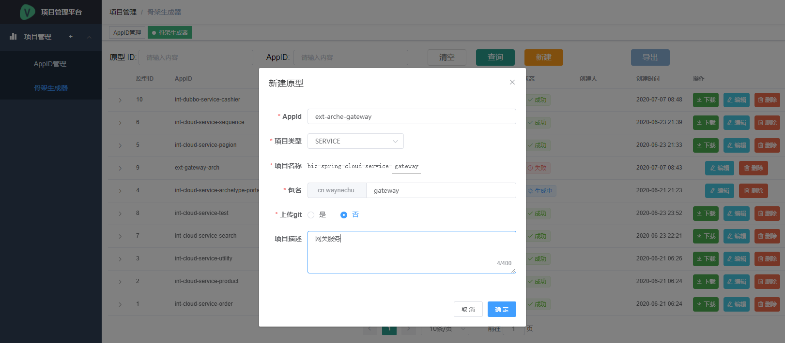
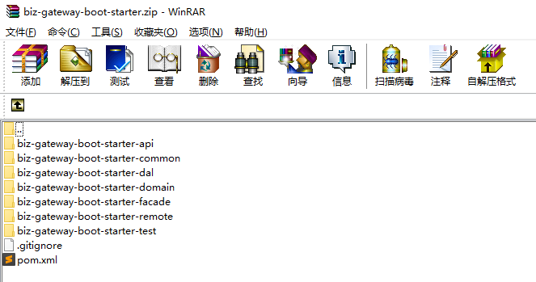

# biz-spring-cloud-archetype

### 项目介绍
1. 用于快速生成SpringCloud项目开发骨架，不用再考虑项目框架搭建及相关组件的集成，实现敏捷开发
2. `biz-archetype-template`基础项目骨架模型jar包可deploy到公司的maven库中，然后使用脚本构建项目骨架原型
3. 同时提供一键生成项目骨架原型页面，可通过页面上的几项简单配置即可生成项目骨架原型，方便快捷
4. 如需自定义项目开发骨架，在`biz-archetype-template`下添加项目模板即可

### 项目骨架原型生成

#### 方式一: 脚本生成
1. 进入`biz-archetype/biz-archetype-portal/biz-archetype-portal-api/src/main/resources/CreateProject.bat`目录
2. 执行命令 `CreateProject.bat 骨架名称 项目名 包名`

例如:
```shell
(Windows) CreateProject.bat biz-archetype-template-service biz-spring-cloud-service-order order
(Linux) CreateProject.sh -a biz-archetype-template-service -n biz-spring-cloud-service-order -p order
```

即可生成项目骨架原型 `biz-spring-cloud-service-order`，并且包名为 `cn.waynechu.order`

#### 方式二: 页面生成（推荐）
1. 启动`biz-archetype-portal`后端服务

2. 启动`biz-archetype-portal-ui`前端项目
    ```
    npm run serve
    ```

3. 在页面上配置项目信息即可生成并下载项目骨架原型

    1. 新增骨架原型  
        

    2. 下载骨架原型  
        

    3. 查看生成的项目骨架  
        
        
### 扩展: Maven Archetype介绍
> http://maven.apache.org/archetype/index.html

Archetype是Maven项目模板工具包。原型被定义为原始的样式或模型，可以制成所有其他同类的东西。原型将帮助用户创建Maven项目模板，
并为用户提供生成这些项目模板的参数化版本的方法。

#### Archetype原型的组成
1. Archetype Descriptor 原型描述符文件  
    `/src/main/resources/META-INF/maven`目录下的`archetype-metadata.xml`  
    这个文件列出了包含在Archetype中的所有文件并将这些文件分类，因此archetype生成机制才能正确的处理。
2. Prototype Files 原型文件  
    `/src/main/resources/archetype-resources/`  
    Archetype插件会复制这些文件
3. Prototype Pom 原型的POM文件  
   `/src/main/resources/archetype-resources/pom.xml`
4. Archetype POM
    `pom.xml`在archetype的根目录下
    
#### Archetype安装及运行
1. 安装Archetype原型
    ```
    mvn clean install
    ```
2. 运行
   ```
   mvn archetype:generate \
     -DarchetypeGroupId=<archetype-groupId> \
     -DarchetypeArtifactId=<archetype-artifactId> \
     -DarchetypeVersion=<archetype-version> \
     -DgroupId=<my-groupId> \
     -DartifactId=<my-artifactId>
     ...
   ```