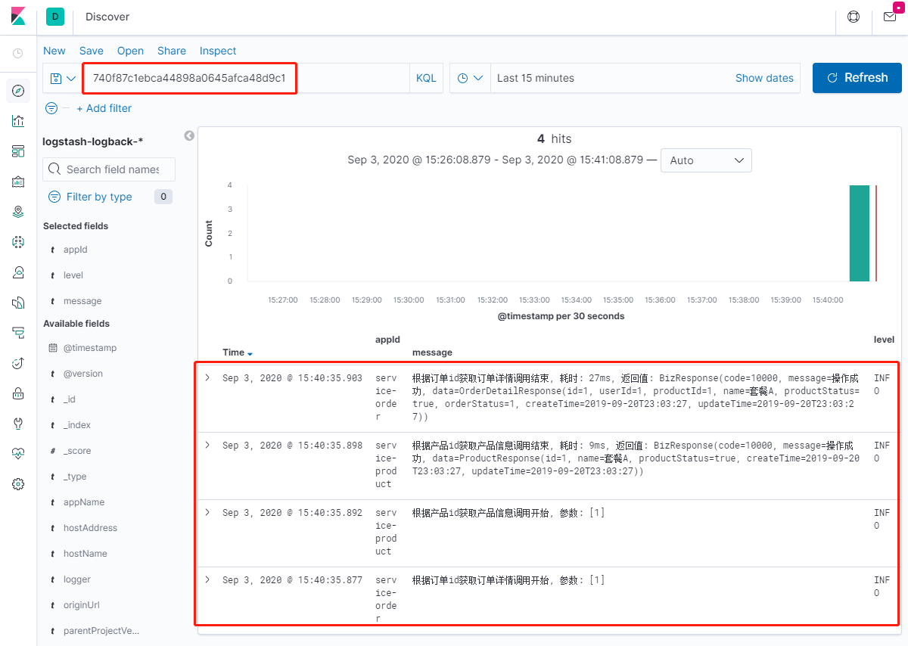
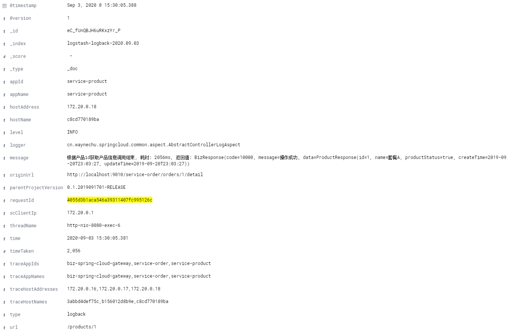

# biz-boot-starter-logger

### 项目介绍
该模块用于将日志上传到elk中(支持RabbitMQ或Kafka两种上传方式)，将异常堆栈信息上传到sentry中。

1. 将logback日志通过Appender发送到指定RabbitMQ消息队列/Kafka消息队列中，然后通过配置logstash的input为
RabbitMQ、output为elasticsearch即可将日志收集到ES中并在Kibana中展示
2. 将error级别日志通过SentryAppender发送到指定的Sentry DSN地址，便于错误日志汇总、Bug排查定位，还能及时收到应用的错误报警
3. 添加调用链路信息到请求头和MDC上下文中，实现微服务的全链路追踪
4. 定制化banner样式
5. 添加默认的 `logback-spring.xml` 配置，实际项目中无需再添加日志配置文件
6. elk中记录的信息除当前服务的基础信息之外，还包含调用方信息、微服务调用链路追踪信息
    ```
     ---------- 基础信息 ----------
     parentProjectVersion - 父项目版本号。该值为 `biz.logger.version.parent-project` 的值，用于定位基础服务框架的版本问题
     appId                - 项目唯一标识。该值为 `spring.application.name` 的值
     appName              - 项目名称。该值为 `spring.application.name` 的值
     hostName             - 服务器名
     hostAddress          - 服务器IP
     logger               - logger名称
     threadName           - 线程名称
     level                - 日志级别
     time                 - 日志时间。格式为 yyyy-MM-dd HH:mm:ss.SSS
     message              - 日志内容
    ```
    示例：`requestId`追踪微服务调用日志

    
    
    

### 调用链路追踪
1. MDCFilter过滤器
    该过滤器用于请求头中的调用方信息添加到 MDC上下文中，并且完善调用链路追踪信息
    ```
    ---------- 调用方信息 ----------
    api-version                - 请求的API版本号
    channel                    - 渠道，调用方标识
    device-id                  - 设备id
    ---------- 链路追踪信息 ----------
    request-id                 - 请求跟踪号，全链路唯一标识。格式为UUID(32个字符)，来自header或者由该过滤器初始化
    sc-client-ip               - 请求来源客户端ip
    origin-url                 - 请求来源地址
    trace-app-ids              - appId调用链路追踪记录。来自header并由该过滤器追加，以`,`分割
    trace-app-names            - appName调用链路追踪记录。来自header并由该过滤器追加，以`,`分割
    trace-host-names           - hostName调用链路追踪记录。来自header并由该过滤器追加，以`,`分割
    trace-host-addresses       - hostAddress调用链路追踪记录。来自header并由该过滤器追加，以`,`分割
   ```

### 使用方式
1. 添加依赖
    ```
    <dependency>
        <groupId>cn.waynechu</groupId>
        <artifactId>biz-boot-starter-logger</artifactId>
    </dependency>
    ```
2. 添加配置
    ```
    ## sentry
    sentry.enable=true
    sentry.dsn=http://a1c395c85d244742ae2a50b90f1535b8@sentry.waynechu.cn:9000/2
    sentry.stacktrace-app-packages=
   
    ## elk-rabbit (两种方式二选一即可)
    elk.rabbitmq.enable=true
    elk.rabbitmq.host=mq.waynechu.cn
    elk.rabbitmq.port=5672
    elk.rabbitmq.username=waynechu
    elk.rabbitmq.password=123456
    elk.rabbitmq.application-id=${spring.application.name}
    elk.rabbitmq.virtual-host=/logback
    elk.rabbitmq.exchange=topic.loggingExchange
    elk.rabbitmq.routing-key=logback.#
    elk.rabbitmq.connection-name=biz|${spring.application.name}
   
    ## elk-kafka (两种方式二选一即可)
    elk.kafka.enable=false
    elk.kafka.host=kafka.waynechu.cn
    elk.kafka.port=9092
    elk.kafka.topic=logback
    ```
   
### 其他说明
1. 如果抛出 `org.springframework.amqp.AmqpConnectException` Rabbit health check failed，这是因为`org.springframework.boot.autoconfigure.amqp.RabbitAutoConfiguration`生效。
    需添加Rabbitmq配置：
    ```
    spring.rabbitmq.host=mq.waynechu.cn
    spring.rabbitmq.port=5672
    spring.rabbitmq.username=waynechu
    spring.rabbitmq.password=123456
    spring.rabbitmq.virtual-host=/logback
    spring.rabbitmq.publisher-confirm-type=correlated
    spring.rabbitmq.publisher-returns=true
    spring.rabbitmq.template.mandatory=true
    ```

2. (可选)如需要自定义日志相关配置，可新建`src/main/resources/logback-custom-spring.xml`来增加相关配置
    ```
    <?xml version="1.0" encoding="UTF-8"?>
    <included>
        自定义配置
    </included>
    ```