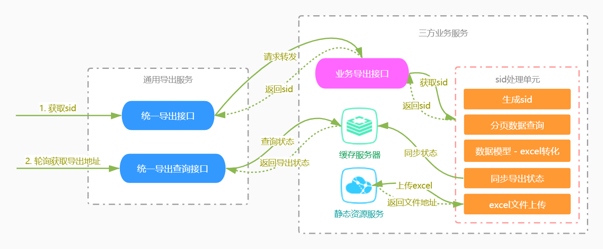

# biz-spring-cloud-api-service-utility
 
### 项目介绍
提供企业公共基础服务。如单项服务QPS过高可从该模块独立出去部署

1. 省市区三级联动服务  
2. 短链生成及短链重定向服务  
3. 日历服务  
4. 通用excel导出服务。用于支持excel异步导出场景  
5. 字典服务

### 扩展一：通用excel导出服务

#### 设计原则
- 尽量降低excel导出时的内存消耗
- 后端导出统一化、前端导出组件化。统一导出规范
- 封装公共导出方法，管理导出的整个生命周期。只用关心业务逻辑，简化开发流程
- 使用自定义线程池异步处理，避免导出占用大量的服务器资源，影响业务接口正常响应
- 引入文件系统。避免因导出文件过大、导出逻辑耗时过长带来的请求超时等的问题

#### 设计思路
1. 公共服务提供统一的excel导出接口，前端通过统一的接口来导出。统一导出接口会根据导出的url参数转发请求到各业务方的接口实现上，并带上导出参数  
    参考`biz-spring-cloud-api-service-utility`公共基础服务的`/excels/export/sid`接口的实现
2. 公共组件包中提供通用异步导出方法。该方法封装分页查库 -> 分页数据写入excel -> excel文件上传 -> 同步导出状态等逻辑  
    参考`biz-spring-cloud-api-starter`公共组件包的`ExcelHelper.java`的实现，提供多种导出方法工业务方使用
3. 支持导出模型不同类型字段支持，包括Java8时间类库以及常用的类型转换支持  
    因为是基于`EasyExcel`实现，所以支持`EasyExcel`中所有的功能特性。包括导出图片，行列合并等
4. 公共服务提供统一的获取导出excel文件下载地址的方法，支持异步轮询下载导出文件
    参考`biz-spring-cloud-api-service-utility`公共基础服务的`/excels/export/status`接口的实现  
5. **扩展**: 可在通用导出服务中添加导出审计日志，记录各业务方接口导出情况。并且可以添加导出权限控制、异常告警等扩展功能

    

#### 使用方式
> 具体使用可参考 `biz-archetype-portal` 服务 `/archetypes/export` 接口。

1. 添加pom依赖
    ```xml
    <dependency>
        <groupId>cn.waynechu</groupId>
        <artifactId>biz-spring-cloud-api-starter</artifactId>
    </dependency>
    ```
2. 在本地项目中添加导出接口，返回sid (即导出唯一标识)
    ```
        @ApiOperation("导出项目原型列表")
        @PostMapping("/export")
        public BizResponse<String> export(@RequestBody SearchArchetypeRequest request) {
            String sid = archetypeService.export(request);
            return BizResponse.success(sid);
        }
    ```
3. 定义导出的Excel模型
    ```
    @Data
    @ApiModel
    public class SearchArchetypeResponse {
    
        @ExcelProperty("原型id")
        @ApiModelProperty("原型id")
        private Long id;
    
        @ExcelIgnore
        @ApiModelProperty("项目类型: 0Service 1SDK")
        private Integer appType;
    
        @ExcelIgnore
        @ApiModelProperty("状态: 0生成中 1成功 2失败")
        private Integer statusCode;
    
        @ExcelProperty(value = "上传git", converter = BooleanConvert.class)
        @ApiModelProperty("上传git: 0否 1是")
        private Boolean gitUploadType;
    
        @ExcelProperty("创建人")
        @ApiModelProperty("创建人")
        private String createdUser;
    
        @ExcelProperty("创建时间")
        @ApiModelProperty("创建时间")
        @JsonFormat(pattern = "yyyy-MM-dd HH:mm", timezone = "GMT+8")
        private LocalDateTime createdTime;
        ...
    }
    ```

   **相关注解说明：**

    | 注解                                                  |   说明                                            | 
    |-------------------------------------------------------|--------------------------------------------------|
    |  @ExcelProperty                                       |   自定义导出的标题头                               |
    |  @ExcelIgnore(可选)                                    |   导出时忽略该字段                                |
    |  @ColumnWidth(可选)                                    |   自定义导出的列宽度。加在类上全局生效，否则单列生效  |
    |  @HeadRowHeight(可选)                                  |   自定义标题列的高度。只能加在类上                  |
    |  @ContentRowHeight(可选)                               |   自定义内容列的高度。只能加在类上                  |
    |  @DateTimeFormat("yyyy年MM月dd日HH时mm分ss秒")(可选)    |   自定义时间字段格式                               |
    |  @NumberFormat("#.##%")(可选)                          |   自定义数值类型格式。如加上百分号等                |
   > 注：如果想要自定义类型转化器，可参考 `cn.waynechu.springcloud.common.excel.convert` 包下的转化器实现。

4. 定义分页查询的方法
    ```
    @Service
    public class ArchetypeServiceImpl implements ArchetypeService {
    
        @Autowired
        private ExcelHelper excelHelper;

        @Override
        public BizPageInfo<SearchArchetypeResponse> search(SearchArchetypeRequest request) {
            ····
        }
    }
    ```
   
5. 使用导出工具类导出
    ```
    @Service
    public class ArchetypeServiceImpl implements ArchetypeService {
    
        @Autowired
        private ExcelHelper excelHelper;

        @Override
        public BizPageInfo<SearchArchetypeResponse> search(SearchArchetypeRequest request) {
            ····
        }
   
        @Override
        public String export(SearchArchetypeRequest request) {
            String fileName = "原型列表 " + LocalDateTime.now().format(DateTimeFormatter.ofPattern("yyyy-MM-dd HH:mm:ss"));
            return excelHelper.exportForSid(fileName, SearchArchetypeResponse.class, request, () -> search(request));
        }
    }
    ```
   > 注：导出工具还提供 exportForSid(final String fileName, Class<T> clazz, List<T> data) 导出方式，该方法只需要传入要导出的list即可。当导出数据量比较小的时候使用该方式比较灵活

6. 前后端联调
    1. 前端请求通用导出地址获取sid。接口地址为: `POST /service-utility/excels/export/sid`  
    2. 通用导出根据地址转发请求到业务放项目的导出接口上。导出地址格式为项目名 + 接口路径  
    3. 前端拿到sid之后调用通用服务接口获取导出结果。 接口地址为: `POST /service-utility/excels/export/status` 

    **导出状态status说明:**
    
    | 状态Code | 状态       |   说明                                     | 
    |----------|-----------|--------------------------------------------|
    |   -1     | 导出失败   | 导出失败，具体失败原因可通过requestId查询      |
    |    0     | 生成中     | 该状态下，前端轮询调用获取导出结果直到状态发生变更。轮询间隔建议从1秒开始指数型递增。如: 1s, 2s, 4s, 8s, 16s, 32s |
    |    1     | 生成成功   | 成功状态下，取返回的url即为导出的excel文件地址 |
