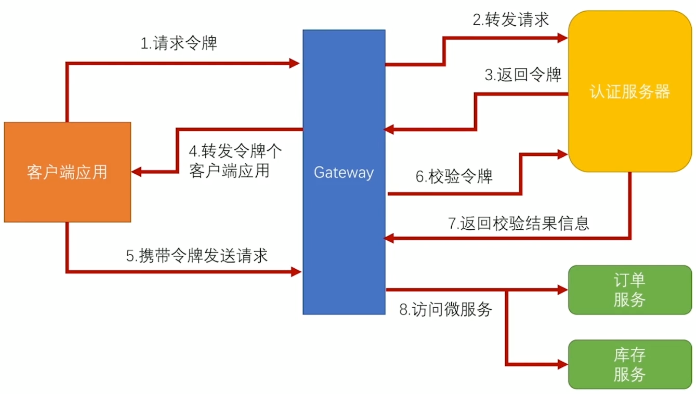

# biz-spring-cloud-gateway

### 项目介绍
微服务网关

### 功能点
- 负载均衡
- 服务聚合
- 动态路由
- 权限控制
- 版本控制(灰度)
- 黑白名单
- 熔断限流
- 链路追踪

### 网关鉴权


### 相关配置说明
自定义swagger文档聚合名称，配置如下:
```
eureka.instance.metadata-map.swagger-name=${spring.applicationName}
```

###  配置版本路由权重
```
spring:
  application:
    name: biz-spring-cloud-gateway
  cloud:
    gateway:
      # 开启基于服务发现的路由规则
      discovery:
        locator:
          enabled: true
          lower-case-service-id: true
      # 配置版本路由权重
      routes:
        - id: users_service_v1
          uri: http://localhost:8081/api/v1
          predicates:
            - Path=/api/v1
            - Weight=service1, 5
        - id: users_service_v2
            uri: http://localhost:8081/api/v2
            predicates:
              - Path=/api/v1
              - Weight=service1, 5
```